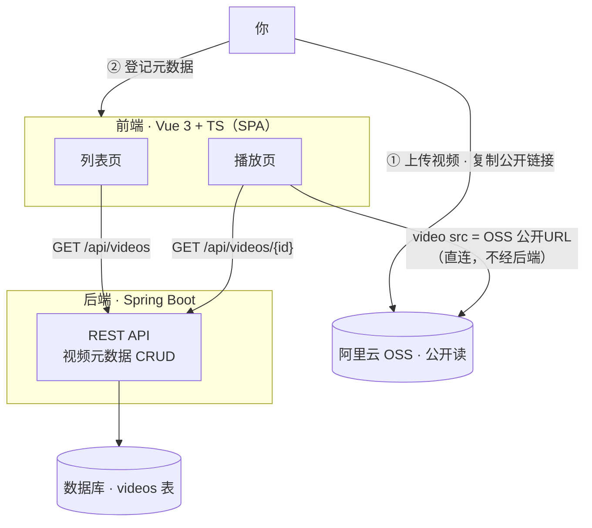
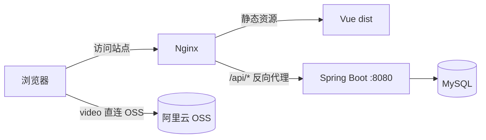

# 个人视频观看站点 · 设计定义

> 日期：2026-09-28
> 状态：待评审（Draft）
> 范围：项目定义 / 设计，不含实现
> 修订：v2 —— 技术栈定为 Vue3 + TS + Spring Boot，架构由「纯静态」改为「前后端分离」

## 1. 背景与目标

**目标**：搭一个只给自己用的视频观看网站。视频文件放在阿里云 OSS 上，打开网站就能看到片库并直接播放。

**一句话定义**：OSS 是片库，Spring Boot 管片库目录，Vue 前端负责展示与播放。

**成功标准**
- 打开网站能看到全部视频的列表
- 点任意一个能在浏览器内直接播放
- 有基本播放操作：进度拖动、音量、全屏、倍速
- 电脑和手机浏览器都能正常使用
- 片库条目可增删改（不必再手改文件）

## 2. 范围

**In（这一版做）**
- 视频元数据的后端 CRUD API
- 视频列表展示（标题 + 封面）
- 播放页
- 响应式：手机可用

**Out（明确不做）**
- 上传、OSS 接入、转码（用户明确：暂不考虑 OSS 怎么传）
- 多用户、注册登录、分享
- 评论、弹幕、点赞
- 付费、会员、推荐算法

## 3. 用户与场景

用户：只有项目 owner（你）一个人。

主流程：
1. 在阿里云 OSS 控制台上传视频，复制公开访问链接
2. 通过后端 API（或管理页）登记一条视频记录
3. 打开网站 → 看到卡片列表 → 点击 → 播放

## 4. 关键决策记录

| 决策 | 选择 | 理由 |
|---|---|---|
| 视频访问方式 | 公开链接（不带签名） | 用户明确接受"谁拿到都能看也没关系" |
| 技术栈 | 前端 Vue3 + TS；后端 Spring Boot | 用户指定 |
| 后端角色 | 片库**元数据**服务（API + DB），**不参与视频流** | 视频走 OSS 公开直链，播放链路不经过后端 |
| 视频托管 | 阿里云 OSS | 用户已有 |
| 上传 / OSS 接入 | 不做（Out of scope） | 用户明确暂不考虑 |
| 片库数据来源 | 后端数据库（替代 v1 的 `videos.json`） | 引入后端后，元数据由 API 提供 |
| 数据库 | MySQL 8 | 用户指定：最常见、好扩展 |
| 部署形态 | 前后端分离（Nginx 托管前端静态 + 反代 `/api`） | 用户指定：标准前后端分离 |

**关于后端价值的一句实话**：这个规模（单用户、公开视频、几十条）本来纯静态就够。引入 Spring Boot 的合理收益在于——(a) 元数据可增删改查，不必手改文件；(b) 为日后「上传直传凭证」「私有化签名 URL」「观看进度同步」留出服务端位置；(c) 你想用 Java 全栈。但前提是后端**不能只把 JSON 换成 API**，否则是空壳——所以 M1 就把元数据 CRUD 纳入范围。

## 5. 架构

- 后端只服务元数据，**视频流不经过后端**，避免后端带宽成为瓶颈。
- 单用户，无登录态（若日后部署公网，见 §12 安全提示）。

## 6. 组件划分

| 组件 | 职责 | 依赖 |
|---|---|---|
| 前端 · 列表页 | 调 API 取列表，渲染卡片 | `GET /api/videos` |
| 前端 · 播放页 | 按 id 取详情并播放 | `GET /api/videos/{id}` |
| 后端 · 视频 API | 视频元数据 CRUD、参数校验 | 数据访问层 |
| 后端 · 数据访问层 | 持久化 | 数据库 |
| 数据库 `videos` 表 | 存元数据 | 无 |
| 阿里云 OSS | 存视频文件（公开读） | 无 |

边界清晰：列表页回答"展示什么"，播放页回答"放哪一个"，后端回答"有哪些、是什么"，OSS 回答"视频文件在哪"。

## 7. 数据流

1. 你在 OSS 控制台上传视频，拿到公开 URL
2. 通过后端 API 登记一条视频记录（标题 + URL + 封面…）
3. 打开网站 → 列表页 `GET /api/videos` → 渲染卡片
4. 点卡片 → 播放页 `GET /api/videos/{id}` → 取 `url` → `<video>` 直连 OSS 播放

## 8. 数据模型

**数据库表 `videos`**

| 列 | 类型 | 必填 | 说明 |
|---|---|---|---|
| `id` | bigint / uuid（PK） | 是 | 主键 |
| `title` | varchar(255) | 是 | 显示标题 |
| `url` | varchar(1024) | 是 | OSS 公开访问地址 |
| `cover` | varchar(1024) | 否 | 封面图地址 |
| `duration` | int | 否 | 时长（秒） |
| `tags` | varchar(255) | 否 | 标签，逗号分隔（后续可拆表） |
| `created_at` | timestamp | 是 | 登记时间 |

**API 契约（M1）**

| 方法 | 路径 | 说明 |
|---|---|---|
| GET | `/api/videos` | 列表（分页 / 排序留 M2） |
| GET | `/api/videos/{id}` | 详情 |
| POST | `/api/videos` | 新增记录 |
| PUT | `/api/videos/{id}` | 修改记录 |
| DELETE | `/api/videos/{id}` | 删除记录 |

返回体统一为 `{ id, title, url, cover, duration, tags, createdAt }`。

## 9. 错误处理

**前端**
- 列表为空 → "片库为空"空状态，不白屏
- API 请求失败 → 错误提示 + 重试
- 视频 URL 404 / 加载失败 → 播放器显示"加载失败"，给原始链接兜底
- 封面加载失败 → 使用占位图

**后端**
- 参数校验失败 → 400，统一错误结构（code / message）
- id 不存在 → 404
- DB 异常 → 500，记录日志，不外泄堆栈

## 10. 测试策略

**前端（Vitest + Vue Test Utils）**
- 列表页：空数据、多条目、API 失败态
- 播放页：按 id 取数、id 不存在的行为
- 视觉验证：桌面 + 手机两个视口截图确认

**后端（JUnit 5 + Spring Boot Test / MockMvc）**
- API 契约：GET 列表、GET 详情、404
- CRUD：POST / PUT / DELETE 生效
- 参数校验：缺字段 → 400
- 仓储层：JPA 映射正确

**不做**：依赖真实 OSS 的端到端网络测试（不稳定）。

## 11. 技术选型

- **前端**：Vue 3 + TypeScript + Vite；Vue Router；按需引入 Pinia；样式 Tailwind CSS
- **播放**：原生 `<video>`；若视频为 HLS（`.m3u8`）则加 `hls.js`
- **后端**：Spring Boot 3.x（Java 17+）；Spring Web；Spring Data JPA；Validation
- **数据库**：MySQL 8（开发可用 Docker Compose 一键起）
- **构建**：后端 Maven 或 Gradle；前端 Vite
- **视频格式建议**：MP4（H.264 + AAC），浏览器兼容最好

### 部署拓扑（前后端分离）

- 前端与后端**同源**（都经 Nginx 出），因此无需处理跨域；后端端口不对外暴露。
- 后端打成 jar 独立运行；Nginx 只管静态资源 + 反代 `/api`。

## 12. 风险与缓解

| 风险 | 缓解 |
|---|---|
| 公开 bucket 被白嫖流量 | OSS Referer 防盗链 + 流量告警 |
| 管理接口（写操作）被公网滥用 | 读接口公开；写接口加固定 token，或仅内网开放 |
| Nginx / 后端代理配置出错 | 前端不直连后端端口，统一走同源 `/api` 反代 |
| 跨地域播放慢 | 挂阿里云 CDN |
| 大文件起播慢 | 使用 moov atom 前置的 MP4 / 加 CDN |
| 后端成为播放瓶颈 | 已规避：视频流不经过后端，走 OSS 直连 |
| 手机流量消耗 | 提示或后续按需转码 |

## 13. 里程碑

- **M1（MVP）**：MySQL `videos` 表 + 后端 CRUD API + 前端列表页 / 播放页 + Nginx 部署上线
- **M2**：管理页（前端录入 / 编辑）、封面、分类标签、搜索、分页
- **M3**：观看进度 / 续播（后端存储，多设备同步）
- **M4（可选）**：网站内上传（STS 直传 OSS）、私有化改造（后端签发签名 URL）

## 14. 已定与待定

**已定**
- 数据库：MySQL 8
- 部署：前后端分离（Nginx 托管前端 + 反代 `/api`）

**待定（附当前默认，无异议即按默认执行）**
1. 鉴权：读接口公开；写接口默认加固定 token（配置项），避免公网被随意增删改。
2. 视频格式：默认 MP4（H.264 + AAC）；日后需要自适应码率再切 HLS。
